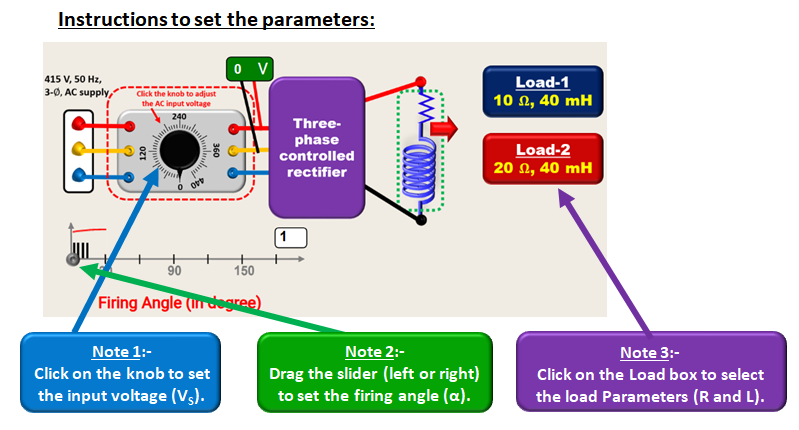

### Procedure

  

#### a) Circuit formulation: 
1. Connect the circuit to form a 3-phase controlled full bridge rectifier 
2. Click on “CHECK” button to verify the circuit. 
3. a). If all connections are correct then click on “NEXT” button and proceed for experimentation. 
b). If connections are wrong, press the “RESET” button and reconnect the terminals to create the correct circuit. 

#### b) Waveforms for different firing angles: 
1. To see the waveforms for different firing angles click “NEXT MODE”. 

#### c) Performance analysis of the Rectifier Circuit: 
1. Set the source voltage. 
2. Select the load out of the options given 
3. Change the firing angle and click on “RECORD” button to fill the table. 
4. Click on respective “ICONS” to see the various performance analysis plots. 

  

