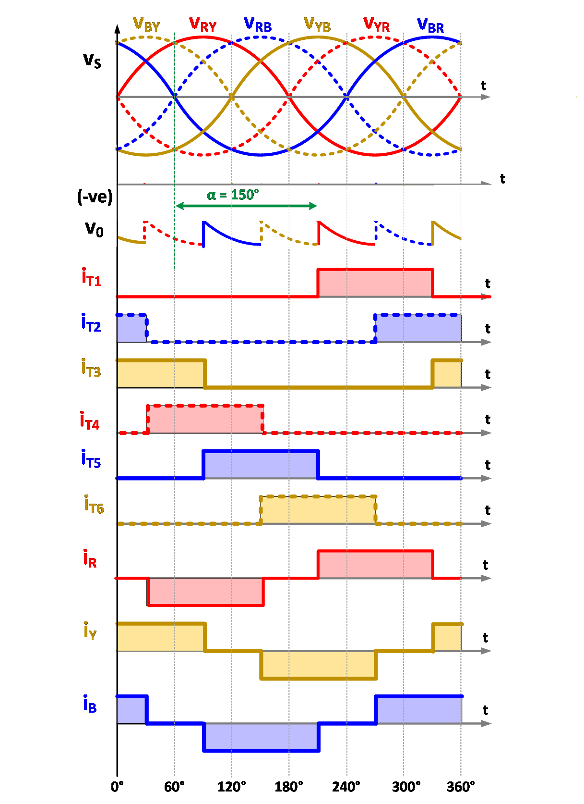

### Theory

The circuit configuration of 3-phase controlled bridge rectifier is given in Fig. 1.

  
  
Fig. 1. Circuit configuration of 3-phase controlled bridge rectifier.

 
The principle of operation of the above circuit can easily be understood from the waveforms given in Fig. 2. The output voltage of a bridge rectifier exhibits a six-pulse waveform with ripple frequency equal to six times the input supply frequency. The thyristors are sequentially numbered (T1, T2, T3, T4, T5 and T6) based on their conduction sequences, with each thyristor conducting for 120&#176; duration. The thyristor connected between the supply lines with the highest instantaneous line-to-line voltage will be forward biased and starts conducting on applying gate pulse to it. 
However when the firing angle is greater than 90 degree the output voltage will be –ve DC as shown in figure 3(d) and 3(e). In such case a negative DC voltage source 
on dc side is required [3] so that the direction of thyristor current remain same. Generally this type of action takes place in case of regenerative mode of the system.
 

  
  
 Fig. 2. Typical waveforms.

 
The output voltage and power delivered can be controlled by changing the firing angle as shown in Fig. 3.
  

<table border="0" align="center" style="width:100%; border:none;">
  <tr>
<td style="width:50%">

  
(a) α = 30&#176;
  

</td>
<td style="width:50%">
  

  
(b) α = 60&#176;
  

 
    </td>
  </tr>
</table>
 

<table border="0" align="center" style="width:100%; border:none;">
  <tr>
<td style="width:50%">

  
(c) α = 90&#176;
  

</td>
<td style="width:50%">
  

  
(d) α = 120&#176;
  

 
    </td>
  </tr>
</table>
 

  
  
(e) α = 150&#176;
  
Fig. 3. Typical waveforms with different firing angle.

 

 
Various mathematical expressions are derived below to quantify the performance of three-phase rectifier.
  
Average voltage appearing across load is defined by
  

 

  

  
    ..(1)

 

 
Simplifying the above equation
  

  
      

    ..(2)

 

 
Average load current is given by

 

  
      

    ..(3)

 

 
where,
 

  
      

    ..(4)

 

 
  Each thyristor conducts for 120&#176;. Hence, the average current through each thyristor can easily be obtained as

 

  
      

  
    ..(5)

 

 
On simplifying the above equation

 

  
      

    ..(6)

 

 
Similarly, the RMS current through each thyristor can be given by
 

  
      

  
    ..(7)

 

 
On simplifying the above equation
 

  
      

 
    ..(8)

 

 
The RMS source current can easily be obtained as
 

  
      

  
    ..(9)

 

 
On simplifying the above equation
 

  
      

 
    ..(10)

 

 
The RMS value of fundamental current is
 

  
      

 
    ..(11)

 

 
The distortion factor (DF) in source current is given by
 

  
      

    ..(12)

 

 
However, the displacement factor (DPF) in source current is given by
 

  
      

    ..(13)

 

 
Hence the power factor is given by
 

  
      

    ..(14)

 

 
On substituting the values from eqns, (12) and (13)
 

  
      

    ..(15)

